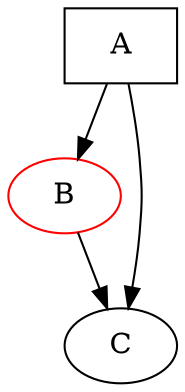

# TAGLINE

图可视化工具包

# TLDR

**将 DOT 文件渲染为 PNG**

```dot -Tpng [graph.dot] -o [graph.png]```

**渲染为 SVG**

```dot -Tsvg [graph.dot] -o [graph.svg]```

**使用不同的布局引擎**

```neato -Tpng [graph.dot] -o [graph.png]```

**渲染为 PDF**

```dot -Tpdf [graph.dot] -o [graph.pdf]```

**环形布局**

```circo -Tpng [graph.dot] -o [graph.png]```

# SYNOPSIS

**dot** [_options_] [_files_]

# PARAMETERS

**-T** _format_
> 输出格式：png、svg、pdf、ps、jpg。

**-o** _file_
> 输出文件。

**-K** _engine_
> 布局引擎：dot、neato、fdp、sfdp、circo、twopi。

**-G** _name=value_
> 设置图属性。

**-N** _name=value_
> 设置节点属性。

**-E** _name=value_
> 设置边属性。

# LAYOUT ENGINES

```
dot    - Hierarchical (directed graphs)
neato  - Spring model (undirected)
fdp    - Force-directed
sfdp   - Scalable force-directed
circo  - Circular layout
twopi  - Radial layout
```

# DOT LANGUAGE



# DESCRIPTION

**Graphviz** 是一个图可视化工具包，它读取以 DOT 语言描述的图并将其渲染为图像。多种布局算法可以处理不同类型的图，从层次化的有向图到力导向的无向布局。

该套件包含多个布局程序（dot、neato、fdp、sfdp、circo、twopi）以及用于格式转换和图操作的工具。

# CAVEATS

大型图的渲染可能较慢。布局质量因算法选择而异。复杂的样式需要学习 DOT 属性。文本渲染效果可能因输出格式而异。

# HISTORY

Graphviz 由 **AT&T 实验室研究院** 开发，**Stephen North**、**Emden Gansner** 等人于 **20 世纪 90 年代**完成了早期工作。它被开源后成为程序化图可视化的事实标准。

# INSTALL

```dnf: sudo dnf install graphviz```

```pacman: sudo pacman -S graphviz```

```zypper: sudo zypper install graphviz```

```brew: brew install graphviz```

```nix: nix profile install nixpkgs#graphviz```

<!-- packages: 2026-07-22 -->

# SEE ALSO

[dot](/man/dot)(1), [neato](/man/neato)(1), [mermaid](/man/mermaid)(1)

# RESOURCES

```[Source code](https://gitlab.com/graphviz/graphviz)```

```[Homepage](https://graphviz.org/)```

```[Documentation](https://graphviz.org/documentation/)```

<!-- verified: 2026-07-17 -->
