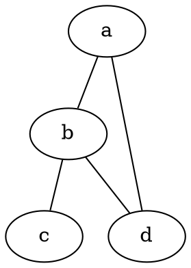

# TAGLINE

Graphviz 面向无向图的布局程序

# TLDR

**从 DOT 文件生成 PNG**

```neato -Tpng [graph.dot] -o [output.png]```

**生成 SVG**

```neato -Tsvg [graph.dot] -o [output.svg]```

**生成 PDF**

```neato -Tpdf [graph.dot] -o [output.pdf]```

**从 stdin 读取**

```echo "graph { a -- b }" | neato -Tpng -o [output.png]```

**设置图属性**

```neato -Gsize="10,10" -Nshape=box [graph.dot] -o [output.png]```

# SYNOPSIS

**neato** [_options_] [_files_...]

# PARAMETERS

**-T** _format_
> 输出格式（png、svg、pdf 等）。

**-o** _file_
> 输出文件。

**-G** _attr=val_
> 图属性。

**-N** _attr=val_
> 节点属性。

**-E** _attr=val_
> 边属性。

**-K** _layout_
> 布局引擎。

# DESCRIPTION

**neato** 是 Graphviz 中面向无向图的布局程序。它使用弹簧模型算法生成美观的布局，非常适合网络拓扑图和关系图。

与 dot（层次布局）不同，neato 生成对称的放射状布局。

# EXAMPLE GRAPH



# LAYOUT ENGINES

```
neato  - Spring model (undirected)
dot    - Hierarchical (directed)
circo  - Circular
fdp    - Force-directed
sfdp   - Large graphs
```

# CAVEATS

更适合无向图。大图可能较慢。重叠消除可能需要调参。

# HISTORY

neato 由 AT&T 实验室的 **Stephen North** 开发，是 Graphviz 套件的一部分，实现了 Kamada-Kawai 弹簧算法。

# INSTALL

```apt: sudo apt install graphviz```

```dnf: sudo dnf install graphviz```

```pacman: sudo pacman -S graphviz```

```apk: sudo apk add graphviz```

```zypper: sudo zypper install graphviz```

```brew: brew install graphviz```

```nix: nix profile install nixpkgs#graphviz```

<!-- packages: 2026-07-22 -->

# SEE ALSO

[dot](/man/dot)(1), [circo](/man/circo)(1), [fdp](/man/fdp)(1), [graphviz](/man/graphviz)(1)
